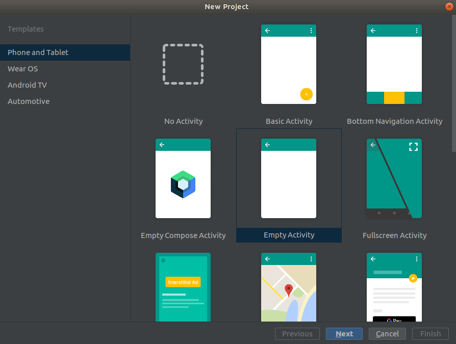

# Kotlin

É a linguagem de programação usada como padrão para desenvolvimento de aplicativos Android.

Kotlin é feita para ser executada junto com o Java com interoperabilidade, ou sejá a partir do Kotlin podemos realizar chamadas a código Java e o mesmo ocorre no caminho inverso. Dessa forma podemos em um projeto Android, criarmos tanto classes Java quanto classes Kotlin sem grandes problemas.

# Kotlin é Orientada a Objetos (OOP).

Assim como o Java ou C# entre outras linguagens, Kotlin é orientada a objetos. Buscando construir programas que possam representar um domínio real, por meio de classes. Por exemplo, podemos definir a classe Pessoa conforme o código abaixo:

```kotlin
class Pessoa
```

Seu arquivo é nomeado como Pessoa.kt, a extensão kt indica ser uma classe kotlin.
Uma classe kotlin ela é definida pela palavra chave, ou keyword, *class*.

# Activity

O Android possui uma classe chamada Activity, ela é uma classe que na maioria das vezes é utilizadas para interagir com o usuário. Ela é uma classe que tem métodos que permite mostrar na tela do dispositivo do usuário, elementos visuais como botões, textos, campos de entradas de dados e outros.

Se você criou um novo projeto por meio do Android Studio, provavelmente deve ter criado a classe MainActivity, ela é criada na maioria dos templates prontos na criação do projeto. Se você ainda não fez isso, experimente criar um novo projeto no Android Studio, e no momento da seleção do template, escolha EmptyActivity.



Siga o restante das etapas, e será possível encontrar a MainActivity no caminho App -> Java -> PACKAGE_DO_PROJETO -> MainActivity.kt.

Uma coisa que ira perceber na sua MainActvity é que ela estende da classe AppCompatActivity.


```kotlin
class MainActvity : AppCompatActivity() {

    override fun onCreate(savedInstanceState: Bundle?) {
        super.onCreate(savedInstanceState)
        setContentView(R.layout.activity_main)
    }
}
```

A classe AppCompatActivity, como o próprio nome diz, ela é uma classe que fornece compatibilidade. Compatibilidade com versões mais antigas do Android. Então sempre utilize ela em seus projetos ao criar uma Activity.


## Herança em Kotlin
Mas voltando a nossa MainActivity, nós sabemos que ela é uma activity por que ela estende de uma AppCompatActivity. No kotlin quando criamos dizemos que uma classe ela estende de outra classe então, nós dizemos que ela herda de uma classe pai.

A sintaxe de herança em kotlin é por meio dos dois pontos `:`, então nó exmplo da MainActivity vemos que herda da AppCompatActivity, e então definimos o construtor que utilizaremos ao herdar a classe pai, no caso um construtor vazio. Indicamos o construtor da classe por meio dos parenteses, como se tivéssemos invocando uma função.

```kotlin
class MainActvity : AppCompatActivity() 
```

## Ciclo de vida

O android possui ciclo de vida para as Activities, ou seja uma activity assim como pessoas, nasce, cresce e morre. A Activity também tem seu ciclo de vida definido por métodos. onCreate, onStart, onResume, onPause, onStop, onDestroy. Vamos estudar isso mais a frente.

## Declarando funções

Vamos pensar na classe Pessoa, vamos supor que criamos um programa que desenha pessoas, esse programa para desenhar uma pessoa precisa da cor da pessoa para poder desenha-la. Então a nossa classe pessoa agora tem um método chamado, getColor.

```kotlin
class Pessoa {

    fun getColor() : String {
        return ""
    }
}
```


Como podemos ver no kotlin declaramos uma função por meio da *keyword* `fun`, em seguida o nome da função no caso *getColor*, e adicionamos um parenteses que pode receber parâmetros, no da função *getColor* não recebe nenhum parâmetro. E por fim encerramos a assinatura da função especificando o retorno, no caso uma String. Assim como Java o tipo String representa um texto também em kotlin. O retorno é separado do nome da função por meio dos dois pontos, assim como quando estendemos uma classe.

## Sobrescrevendo metodos herdados (Sobrecarga).

Agora voltando ao nosso programa de colorir pessoas, agora nosso programa é capaz de colorir uma pessoa já que criamos um método getColor que retorna a cor da pessoa.

No entanto surge um novo problema, pessoas se diferenciar pela cor da pele, para reduzir o escopo do nosso problema, vamos pensar apenas nas pessoas brancas e pretas.

Para isso vamos criar duas novas classes *PessoaBranca* e *PessoaPreta*, essas classes herdarão da classe base *Pessoa*.

```kotlin
class PessoaBranca : Pessoa() {

    override fun getColor() : String {
        return "#FFFFFF"
    }
}
```

```kotlin
class PessoaPreta : Pessoa() {

    override fun getColor() : String {
        return "#000000"
    }
}
```
Agora veja que as nossas classes que herdam de pessoa ela ira ter o mesmo comportamento da classe pai *Pessoa* no entanto seu método *getColor* foi sobrescrito de tal forma a atender as particularidades de cada etnia.

  

O método getColor, foi sobrescrito com o auxilio da palavra chave `override`, em seguida repetimos a assinatura da classe pessoa, no entanto substituímos o retorno.

## Definindo o layout da Activity

Agora que entendemos como são as funções em kotlin e o conceito de herança e sobrecarga de métodos. Vemos que nossa MainActivity ela sobrescreve o método onCreate, que representa o ciclo de vida da Activity.


```kotlin
class MainActvity : AppCompatActivity() {

    override fun onCreate(savedInstanceState: Bundle?) {
        super.onCreate(savedInstanceState)
        setContentView(R.layout.activity_main)
    }
}
```

O que podemos queremos fazer ao sobrescrever o método onCreate, é definir o layout ou seja o que sera exibido para o usuário, para isso preste bastante atenção em um ponto, o método onCreate é sobrescrito, mas mesmo assim ele executa o método base da Activity ao chamar o método super.onCreate(savedInstanceState).

Não entendeu? Vamos criar a classe Teclado e TecladoGamer.

```kotlin
class Teclado {

    fun digita(letra: String){
        print(letra)
    }
}
```

```kotlin
class TecladoGamer:Teclado() {

    override fun digita(letra: String){
        super.digita(letra)
        piscaLed()
    }

    fun piscaLed() {
        ...
    }
}
```

Como vemos no exemplo, a classe teclado tem o método `digita(String)` que vai printar uma letra digitada pelo usuário. Já a classe TecladoGamer herda de teclado e sobrescreve o método `digita(String)`, no entanto agora ao digitar com o teclado gamer, alem de printar a letra digitada, a classe TecladoGamer também pisca um led. Veja que não chamamos explicitamente o método `print()` na função digita na classe TecladoGamer, e sim de forma implícita por meio do uso do `super` que indica que deve ser executado o método da classe pai.


Por fim nossa MainAcitivy sobrescreve o método onCreate chamando o onCreate do pai, necessário para o funcionamento correto da classe AppCompatActivity, no entanto foi executado o método `setContentView(Int)`. Este método especifica o layout a ser utilizado pela sua Activity.


```kotlin
class MainActvity : AppCompatActivity() {

    override fun onCreate(savedInstanceState: Bundle?) {
        super.onCreate(savedInstanceState)
        setContentView(R.layout.activity_main)
    }
}
```

Agora vamos dar uma olhada no nosso layout activity_main.xml, vemos que ele tem seu layout construído por meio do LinearLayout, também possui um elemento de texto, *txt_orientacao*, um campo de digitar texto ,*edt_name* e um botão *bt_mostra_toast_saudacao*.

```xml
<?xml version="1.0" encoding="utf-8"?>
<LinearLayout xmlns:android="http://schemas.android.com/apk/res/android"
    xmlns:app="http://schemas.android.com/apk/res-auto"
    xmlns:tools="http://schemas.android.com/tools"
    android:layout_width="match_parent"
    android:layout_height="match_parent"
    tools:context=".MainActivity"
    android:gravity="center"
    android:id="@+id/root2"
    android:orientation="vertical">

    <TextView
        android:id="@+id/txt_orientacao"
        android:layout_width="wrap_content"
        android:layout_height="wrap_content"
        android:text="Digite seu nome"/>

    <EditText
        android:id="@+id/edt_name"
        android:layout_width="wrap_content"
        android:layout_height="wrap_content"
        android:hint="Nome"/>

    <Button
        android:id="@+id/bt_mostra_toast_saudacao"
        android:layout_width="wrap_content"
        android:layout_height="wrap_content"
        android:text="Mostrar Saudacao"/>
    
</LinearLayout>
```

Vamos interagir com nossos elementos visuais programaticamente, para isso também no método onCreate, vamos definir três variáveis, uma variavel é a *txtOrientacao*, outra é *edtName* a outra variável é a *btMostraToastSaudacao*.

Definimos uma variavel em kotlin por meio da keyword `val` e `var`, uma variável declarada com a keyword `var` é mutável, exemplo a idade de uma pessoa poderia ser declarada como var já que sempre incrementa. Já um exemplo de `val` seria a data de nascimento da pessoa, que é impossível mudar depois que a pessoa já foi criada.


Então vamos ver a declaração dessas variáveis no método onCreate

```kotlin
class MainActvity : AppCompatActivity() {

    override fun onCreate(savedInstanceState: Bundle?) {
        super.onCreate(savedInstanceState)
        setContentView(R.layout.activity_main)

        /*
        O metodo findViewById(), encontra a referencia a um elemento no layout
         por meido id declarado no arquivo xml.
        */

        val txtOrientacao : TextView = findViewById(R.id.txt_orientacao)
        val edtName : EditText = findViewById(R.id.edt_name)
        val btMostraToastSaudacao : Button = findViewById(R.id.bt_mostra_toast_saudacao)
    }
}

```
Veja que criamos as nossas variáveis, primeiro declaramos se ela sera mutável ou imutável por meio da escolha das keywords, val e var, no caso usamos val, ou seja nunca mais essas variáveis podem ser sobrescritas. Apos isso damos um nome a nossa variável seguindo o padrão camelcase e adicionamos o seu tipo, kotlin é fortemente tipado. Seu tipo é definido logo após o nome por meio da separação com os dois pontos `:`. E por fim além de criarmos as variáveis já inicializamos ela igualando as instancias retornadas por meio do método findViewById() que herdamos também ao herdar nossa MainActivity da classe.


## Eventos de clique acessando propriedades de variáveis.

  

Agora vamos fazer nosso app ser interativo, para isso vamos adicionar um evento de clique no botão, por meio da método setOnClickListener, todo elemento de tela tem esse método. Acessar a propriedade text do nosso campo de digitação onde o usuário digitara o nome e por fim exibiremos uma mensagem de boas vindas.

```kotlin
class MainActvity : AppCompatActivity() {

    override fun onCreate(savedInstanceState: Bundle?) {
        super.onCreate(savedInstanceState)
        setContentView(R.layout.activity_main)

        /*
        O metodo findViewById(), encontra a referencia a um elemento no layout
         por meido id declarado no arquivo xml.
        */

        val txtSaudacao : TextView = findViewById(R.id.txt_orientacao)
        val edtName : EditText = findViewById(R.id.txt_orientacao)
        val btMostraToastSaudacao : Button = findViewById(R.id.bt_mostra_toast_saudacao)

        btMostraToastSaudacao.setOnClickListener {
            mostrarSaudacao(edtName.text.toString())
        }
    }

    private fun mostrarSaudacao(nome:String) {
        Toast.makeText(this, "Ola " + nome + " !!", Toast.LENGTH_SHORT).show()

    }
}

```

Veja que criamos uma função que chamada mostrarSaudacao, ele recebe um parâmetro, no caso o *nome* que é uma String, e ela então executa uma outra função da classe Toast do Android, que exibe um popup para o usuário.

  

A função mostrarSaudacao é executada toda vez que o usuário clicar no botão btMostraToastSaudacao, na verdade é executado tudo que estiver dentro do setOnclickListener, no caso somente a função mostrarSaudacao. E vemos que acessamos o nosso campo de digitação por meio da propriedade text, convertemos ela para string, por meio do método .toString() e passamos como parâmetro para função mostrarSaudardaco().