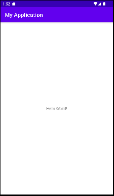

# Activity

  

O Android possui uma classe chamada Activity, ela é uma classe que na maioria das vezes é utilizadas para interagir com o usuário. Ela é uma classe que tem métodos que permite mostrar na tela do dispositivo do usuário, elementos visuais como botões, textos, campos de entradas de dados e outros.

  

Se você criou um novo projeto por meio do Android Studio, provavelmente deve ter criado a classe MainActivity, ela é criada na maioria dos templates prontos na criação do projeto. Se você ainda não fez isso, experimente criar um novo projeto no Android Studio, e no momento da seleção do template, escolha EmptyActivity.

  


  

Siga o restante das etapas, e será possível encontrar a MainActivity no caminho App -> Java -> PACKAGE_DO_PROJETO -> MainActivity.kt.

  

Uma coisa que ira perceber na sua MainActvity é que ela estende da classe AppCompatActivity.

  
  

```kotlin

class MainActvity : AppCompatActivity() {

  

override fun onCreate(savedInstanceState: Bundle?) {

super.onCreate(savedInstanceState)

setContentView(R.layout.activity_main)

}

}

```

  

A classe AppCompatActivity, como o próprio nome diz, ela é uma classe que fornece compatibilidade. Compatibilidade com versões mais antigas do Android. Então sempre utilize ela em seus projetos ao criar uma Activity.

  
  

## Herança em Kotlin

Mas voltando a nossa MainActivity, nós sabemos que ela é uma activity por que ela estende de uma AppCompatActivity. No kotlin quando criamos dizemos que uma classe ela estende de outra classe então, nós dizemos que ela herda de uma classe pai.

  

A sintaxe de herança em kotlin é por meio dos dois pontos `:`, então nó exmplo da MainActivity vemos que herda da AppCompatActivity, e então definimos o construtor que utilizaremos ao herdar a classe pai, no caso um construtor vazio. Indicamos o construtor da classe por meio dos parenteses, como se tivéssemos invocando uma função.

  

```kotlin

class MainActvity : AppCompatActivity()

```

  

## Ciclo de vida

  

O android possui ciclo de vida para as Activities, ou seja uma activity assim como pessoas, nasce, cresce e morre. A Activity também tem seu ciclo de vida definido por métodos. onCreate, onStart, onResume, onPause, onStop, onDestroy.

  

O ciclo de vida das activities funcionam como funções de callback, ao qual o desenvolvedor pode implementar uma determinada ação dependendo do estado de vida atual da Activity.

  

### OnCreate

  

Esse callback é acionado assim que o sistema do usuario inicia a Activity. Você deve então implementar uma logica simples nesse callback, já que ele deve ser executado de maneira rapida para que a tela do usuario não fique travada.

  

## Definindo o layout da Activity

  

Vemos que nossa MainActivity ela sobrescreve o método onCreate, que representa o ciclo de vida da Activity.

  
  

```kotlin

class MainActvity : AppCompatActivity() {

  

override fun onCreate(savedInstanceState: Bundle?) {

super.onCreate(savedInstanceState)

setContentView(R.layout.activity_main)

}

}

```

  

Nossa MainAcitivy sobrescreve o método onCreate chamando o onCreate do pai, que é necessário para o funcionamento correto da classe `AppCompatActivity`, no entanto foi executado o método `setContentView(Int)`. Este método especifica o layout a ser utilizado pela sua `Activity`.

  
  

```kotlin

class MainActvity : AppCompatActivity() {

  

override fun onCreate(savedInstanceState: Bundle?) {

super.onCreate(savedInstanceState)

setContentView(R.layout.activity_main)

}

}

```

  

Agora vamos dar uma olhada no nosso layout activity_main.xml, vemos que ele tem seu layout construído por meio do `ConstraintLayout`, também possui um elemento de texto do tipo `TextView`.

  

```xml

<?xml version="1.0" encoding="utf-8"?>

<androidx.constraintlayout.widget.ConstraintLayout  xmlns:android="http://schemas.android.com/apk/res/android"

xmlns:app="http://schemas.android.com/apk/res-auto"

xmlns:tools="http://schemas.android.com/tools"

android:layout_width="match_parent"

android:layout_height="match_parent"

tools:context=".MainActivity">

  

<TextView

android:layout_width="wrap_content"

android:layout_height="wrap_content"

android:text="Hello World!"

app:layout_constraintBottom_toBottomOf="parent"

app:layout_constraintEnd_toEndOf="parent"

app:layout_constraintStart_toStartOf="parent"

app:layout_constraintTop_toTopOf="parent"  />

  

</androidx.constraintlayout.widget.ConstraintLayout>

```

  

Ao executar o app é possível ver a interface do seu app.

  



  

É interessante que além do layout da sua `Activity`, é possível ver um header, no android chamamos esse header de `Toolbar`, e a sua configuração é feita por meio do manifest.

  

## Declaração da Activity no Manifest

Um app pode ter mais de uma Activity e toda Activity no Android deve ser declarada no arquivo AndroidManifest.xml. Ao abir o arquivo AndroidManifest vemos que dentro da tag "application" aonde definimos as propriedades da nossa aplicação, também temos um tag chamada "activity"

  

```xml

<activity

android:name=".MainActivity"

android:exported="true">

<intent-filter>

<action  android:name="android.intent.action.MAIN"  />

  

<category  android:name="android.intent.category.LAUNCHER"  />

</intent-filter>

</activity>

```

  

Vamos explicar os atributos da nossa tag `Activity`.

  

**android:name** indica o caminho ou diretório da sua classe `Activity`.

**android:exported** indica que uma outra aplicação fora da sua pode iniciar sua `Activity`. A nossa `Activity` principal geralmente o *exported* é verdadeiro permitindo o sistema iniciar nossa aplicação.

  

Além disso temos dentro da nossa Activity, uma tag intent-filter, essa tag indica quais eventos sua `Activity` vai responder. Ao configurar seu *intent-filter* como a tag action **android:name="android.intent.action.MAIN"** e a tag category **android:name="android.intent.category.LAUNCHER"** você indica que essa é a `Activity` principal da sua aplicação.

  

Além disso podemos definir o tema da nossa `Activity` por meio da tag **android:theme,** caso não seja declarada ela ira herdar o tema definido na nossa tag `application`.

  

Ao acessar o tema da application vejá como ela é

  

```xml

<!-- Base application theme. -->

<style  name="Theme.MyApplication"  parent="Theme.MaterialComponents.DayNight.DarkActionBar">

<!-- Primary brand color. -->

<item  name="colorPrimary">@color/purple_500</item>

<item  name="colorPrimaryVariant">@color/purple_700</item>

<item  name="colorOnPrimary">@color/white</item>

<!-- Secondary brand color. -->

<item  name="colorSecondary">@color/teal_200</item>

<item  name="colorSecondaryVariant">@color/teal_700</item>

<item  name="colorOnSecondary">@color/black</item>

<!-- Status bar color. -->

<item  name="android:statusBarColor">?attr/colorPrimaryVariant</item>

<!-- Customize your theme here. -->

</style>

```

  

Também na nossa tag `Activity`, temos também a tag **android:label**, aonde definimos o titulo que será exibido na nossa Toolbar.

  

É possível remover a `Toolbar` de uma `Activity` por meio do tema, utilizando um tema *NoActionBar*. Para isso vamos criar um tema chamado

```xml

<style  name="Theme.MyApplication.NoActionBar"  parent="Theme.MaterialComponents.DayNight.NoActionBar"  />

```

Veja que ele a unica alteração foi que antes o tema herdava de uma *DarkActionBar* e agora é de uma *NoActionBar*, indicando que sua `Activity` não tem `Toolbar`.

  

Agora só precisamos aplicar o tema a nossa `Activity` por meio da tag **android:theme**