# ConstraintLayout

O _ConstraintLayout_, é um layout que organiza seus elementos filhos de maneira relacional entre os elementos filhos, criando uma relação entre irmãos, ou em relação a si mesmo, criando uma relação pai e filho.

## Documentação

A documentação pode ser encontrada [aqui](https://developer.android.com/training/constraint-layout)

## Vantagens

- O _ConstraintLayout_ é um layout responsivo, se adaptando facilmente a diferentes tamanhos de telas.

- Também é possível fazer layouts complexos, dispondo seus elementos filhos livremente por dentro do layout.

- Além disso é possível criar regras relacionais entre elementos filhos, criar barreiras em que os elementos filhos não ultrapassem, criar grupos de elementos entre muitas outras funcionalidades do _ConstraintLayout_.

## Conceitos

Elemento filho: São os elementos que são encapsulados pelo _ConstraintLayout_. Esses elementos podem ser _TextView_, _Button_, _EditText_, _Layouts_ entre outros.

_Constraints_: São regras ou restrições que os elementos filhos devem respeitar dentro do layout.

Ancorar: Quando se estabelece uma _constraints_.

Relação pai e filho: É uma relação onde o elemento filho tem suas regras definidas em relação ao próprio _ConstraintLayout_.

Relação entre irmãos: É uma relação onde um elemento filho define suas _constraints_ em relação a um outro elemento filho do _ConstraintLayout_.

## Uso

Para utilizar o _ConstraintLayout_ crie um arquivo de layout e adicione ou verifique se já possui um elemento _ConstraintLayout_ neste arquivo.

No modo design, observe a arvore de componentes do seu layout.

Os elementos filhos de um _ConstraintLayout_, requer ao menos uma **_constraint_ vertical** e uma **_constraint_ horizontal**. A _constraint_ vertical indica como o elemento filho deve se posicionar dentro do layout verticalmente. Já a _constraint_ horizontal indica como o elemento filho deve se posicionar horizontalmente dentro do layout.

Ao abrir seu arquivo de layout, com extensão **.xml**, o Android Studio no **modo design**. Permite mover os elementos para o interior do _ConstraintLayout_, puxando e arrastando.

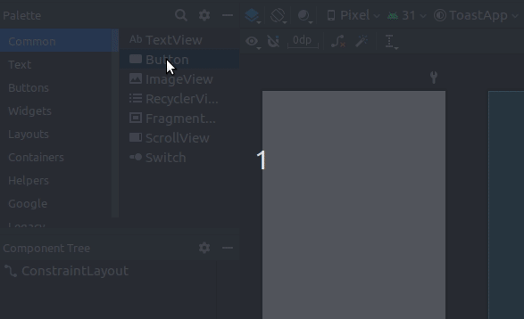

Ao selecionar um elemento que está dentro do _ConstraintLayout_ é possível ver 4 indicadores ao redor do elemento selecionado. Esses indicadores são utilizados para ancorar, estabelecendo as _constraints_ dos elementos filhos.

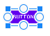

Você pode clicar em um desses indicadores, segurar e puxar para a direção em que deseja estabelecer a _constraint_.

Os indicadores de inicio e fim do elemento, são utilizados para estabelecer **_constraints_ horizontais**.

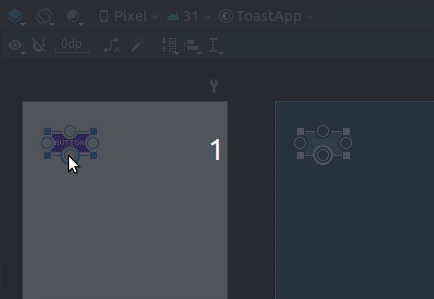

Já os indicadores do topo e da parte de baixo do elemento, são utilizados para estabelecer **_constraints_ verticais**.

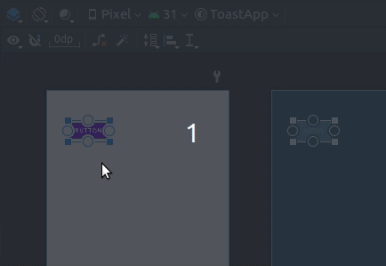

**_Ao menos uma _constraint_ horizontal e uma _constraint_ vertical deve ser definida nos elementos filhos do _ConstraintLayout_**

Através do menu layout que fica no canto direito do Android Studio, é possível ajustar as margens do elemento em relação as suas _constraints_.

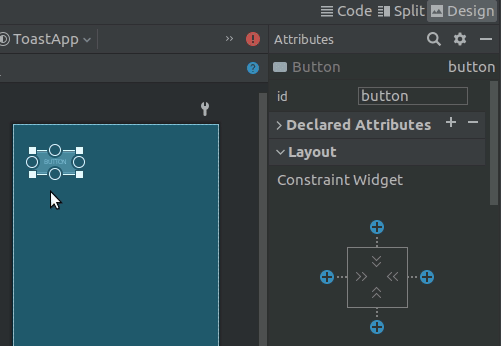

Quando ancora um elemento filho em uma parede do _ConstraintLayout_, está sendo feita uma relação filho para pai.

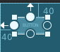

Quando ancorada um elemento em relação a outro elemento, então está sendo realizada uma relação irmão para irmão.

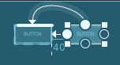

## Definindo _contraints_

Geralmente o primeiro elemento possui suas _constraints_ definidas em relação ao pai. No exemplo abaixo, é possível ver que o elemento A, seu topo está ancorado ao topo do _ConstraintLayout_ e seu inicio está também ancorado ao inicio do _ConstraintLayout_, definindo uma relação pai e filho.

Agora é adicionado o elemento B ao _ConstraintLayout_, este elemento o seu topo está ligado ao topo do _ConstraintLayout_, e seu fim está ancorado ao fim do _ConstraintLayout_.

Agora é incluído o elemento C ao _ConstraintLayout_, este elemento possui relação pai e filho horizontalmente, e relação entre irmãos verticalmente. Onde o inicio de C está ancorado ao _ConstraintLayout_ e o topo de C está ancorado a parte de baixo de A.

O inicio do elemento C está ancorado ao inicio do _ConstraintLayout_ definindo uma relação pai e filho. E seu topo está ligado a parte de baixo do elemento A, definindo uma relação entre irmãos.

Agora existe o elemento D, que seu inicio está ligado ao fim do elemento C, criando uma _constraint_ horizontal.

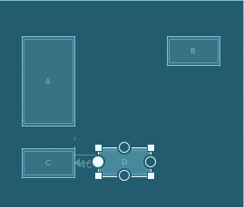

No entanto surge uma questão, qual seria sua _constraint_ vertical? aonde ancoro o topo ou a parte de baixo do elemento D? seria em relação ao Pai, o próprio _ConstraintLayout_? seria em relação a o elemento A? elemento B? ou em relação ao elemento C?

> Olhe as margens

Olhe as margens que seria necessária para que o elemento fique posicionado aonde deveria. 

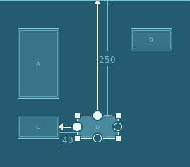 
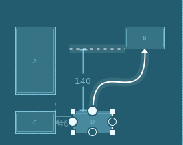
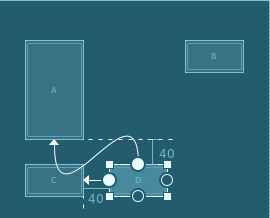
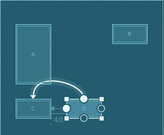

Uma boa dica é: _Quanto menor a margem então mais ideal é a constraint_

No caso, é possível ver que a margem de topo em relação ao topo do _ConstraintLayout_ é 250, já em relação a B é 140, em relação a A é 40, e por ultimo em relação a C, é zero. **Logo a melhor escolha seria em relação a C onde a margem é zero**

A maneira de centralizar um elemento em um espaço, é definindo as _constraints_ do elemento em relação inicio e fim do espaço onde deseja que este elemento seja centralizado. O elemento F ilustra esse comportamento.

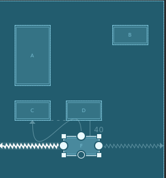.

## Conseguimos!!

Agora o básico de _ConstraintLayout_ foi explicado, tente imitar o que foi aprendido para reforçar seus conhecimentos.