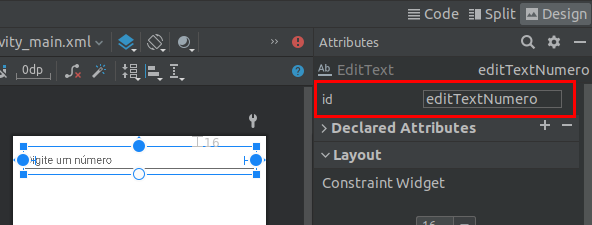

# Interagindo com componentes da tela

  

Ao desenvolver um aplicativo, a maioria das vezes é necessário uma ação por parte do usuário como por exemplo um toque em um botão, para executar uma musica ou dar um "gostei" em algum vídeo, também um campo de entrada de texto para que o usuário possa preencher algum formulário ou comentar em alguma postagem, entre outras interações por parte do usuário. Sendo assim além da criação da tela por meio de arquivos de *layout*, também é necessário adicionar interação aos componentes que compõe essas telas.

  
  

## findViewById

  

As *activities* possuem um método chamado `findViewById(viewId:Int)`, esse método retorna a referência a algum objeto do *layout*, por meio da passagem do id desse componente que foi declarado na sessão de atributos

  

.

  

Dessa forma lá na classe da `Activity`, é possível criar um vinculo entre este componente e uma variável para que então possa ser feito o uso do componente dinamicamente.

  
  

```kotlin

class MainActivity : AppCompatActivity() {
  

// declara variavel

lateinit var editTextNumero: EditText

  

override fun onCreate(savedInstanceState: Bundle?) {
super.onCreate(savedInstanceState)
setContentView(R.layout.activity_main)
  

// inicializa variavel usando o método findViewById

editTextNumero = findViewById(R.id.editTextNumero)

}

```

  

Primeiro é necessário declarar uma variável correspondente ao tipo do componente que está sendo usado no arquivo de *layout*, no caso um `EditText`

```kotlin
lateinit var editTextNumero: EditText
```

  

Note que foi usado a *keyword* `lateinit`, isso é por que só será possível atribuir valor a variável `editTextNumero`, após o método `setContentView` no método `onCreate` da `Activity`, isso acontece por conta do ciclo de vida da `Activity`.

  
  
  

## Adicionando um evento de clique a um botão

  

O código abaixo mostra como adicionar um evento de clique a um botão, permitindo então executar qualquer bloco de código a partir do toque do usuário.

  

```kotlin

class MainActivity : AppCompatActivity() {

  

lateinit var buttonSoma: Button

  

override fun onCreate(savedInstanceState: Bundle?) {

super.onCreate(savedInstanceState)

setContentView(R.layout.activity_main)
  

// inicializa variavel usando o método findViewById

buttonSoma = findViewById(R.id.buttonSoma)


buttonSoma.setOnClickListener {

// adicionar algum bloco para ser executado no momento do clique, atenção as chaves que delimitam o seu bloco de código.

}

}
```

  
  

## Coletando o texto digitado pelo usuário

  

Ao utilizar o componente `EditText`, é possível pegar o texto digitado pelo usuário para fazer alguma logica que seja necessária, observe o código abaixo.

  

```kotlin

class MainActivity : AppCompatActivity() {


lateinit var editTextNome: EditText
 

override fun onCreate(savedInstanceState: Bundle?) {

super.onCreate(savedInstanceState)

setContentView(R.layout.activity_main)

  

editTextNome = findViewById(R.id.editTextNome)

  

var nomeDigitado = editTextNome.text.toString()

}
```

  

Note que a variável `nomeDigitado` foi declara sem a utilização do `lateinit`, isso por que no mesmo comando de declaração também foi atribuído um valor a ela.

  

## Conversão de texto em numero

  

As vezes é necessário pegar algum valor numérico do usuário, no entanto como já vimos o componente que permite a entrada de dados do usuário é o `EditText`, e ele retorna o texto digitado em formato `String`. No entanto para realizar operações matemáticas é necessário fazer a conversão de `String` para um formato como o `Int`, veja o exemplo abaixo.

  

```kotlin

var textoDigitado: String = "123"

// conversão para o formato Int

var textoConvertido: Int = textoDigitado.toInt()

```

  

Veja que o código acima mostra que a variável `textoDigitado` é uma `String`, esse valor foi armazenado na variável `textoConvertido` por meio da função `toInt()`.