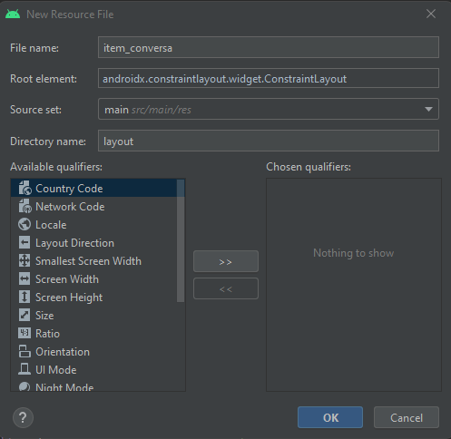
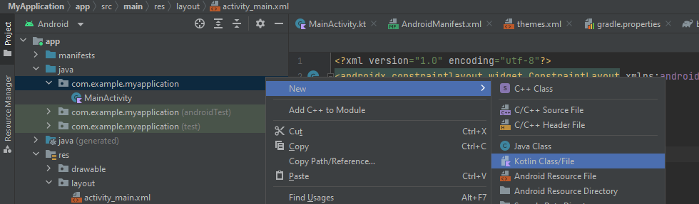

# Listas com RecyclerView
Em muitos aplicativos existe a necessidade de exibir informações no formato de lista, para isso os desenvolvedores Android podem usar um componente chamado `RecyclerView`.
O componente `RecyclerView` é um componente visual comum que pode ser encontrado na paleta de componentes na seção comum no modo design.
O componente `RecyclerView` por si só não é suficiente para exibir uma lista de dados, ele antes deve ser configurado por meio de uma classe `RecyclerView.Adapter`, além disso também é necessário que seja especificado um `LayoutManager`, que indica ao `RecyclerView` como será exibida a lista, em forma linear, grid ou outra forma customizada.
A implementação do `RecyclerView` consiste em quatro etapas:

- Criar layout do item da lista

- Criar `ViewHolder`, uma classe *kotlin* que faz referencia aos componentes presente no layout do item da lista

- Criar a classe Adapter que ira gerenciar os dados que serão exibidos na lista

- Adicionar componente RecyclerView ao layout da sua tela e aplicar o adapter criado e o LayoutManager

## Criar layout do item da lista

Uma lista exibe diversos itens, e é comum que esses itens da lista tenham uma semelhança em sua estrutura, veja por exemplo a lista de conversas no aplicativo *WhatsApp*.


Como é possível ver, todas as conversas possuem uma imagem indicando a quem essa conversa é destinada, um texto com o nome do contato, a hora da ultima mensagem e por fim um resumo da ultima mensagem enviada naquela conversa.
A etapa da criação do layout do item consiste em criar o layout padrão desses itens, para isso é necessario criar um novo arquivo de layout dentro de res -> layout -> new => Layout Resource File e nomeie o arquivo de layout que será criado. Ao criar um o layout de um item de layout, é recomendavel usar um prefixo por exemplo **item_** conversas, o nome não deve conter espaços, acentos ou caracteres especiais.



O layout do item deve ser um padrão por exemplo o layout abaixo:


Para esse layout foi usado um componente de imagem como o `ImageView` para exibir a foto do contato. Também foram usados três componentes do tipo `TextView` um para o nome do contato, resumo da ultima conversa, e horário da ultima conversa.


É necessario criar um ViewHolder para exibir a lista em um recyclerview, esse ViewHolder é uma classe em kotlin que representa o layout.

Para isso basta criar uma nova classe em kotlin, clicando com o botão direito denro do diretorio de pastas do seu projeto e selecionando a opção new -> kotlin Class/File



veja o código abaixo da classe ViewHolder que foi criada:

```kotlin

class ViewHolderConversa(view: View) : ViewHolder(view) {

var fotoImageView : ImageView = view.findViewById(R.id.fotoImageView)

var nomeTextView : TextView = view.findViewById(R.id.nomeTextView)

var conversaTextView : TextView = view.findViewById(R.id.conversaTextView)

}

```

Cada um dos componentes do layout **xml**, item_conversa.xml foi declarado na classe `ViewHolderConversa`. A classe `ViewHolderConversa`, ela recebe como parâmetro de construtor um parâmetro *view* do tipo `View`, e este parâmetro é passado para a classe pai `ViewHolder`, que obrigatoriamente todo `ViewHolder` de qualquer adapter deve herdar desta classe.

## Criar Adapter

O conteúdo que vai ser exibido na lista ele é gerenciado por uma classe *kotlin* "adapter", está classe ela estende da classe `RecyclerView.Adapter`, e possui alguns métodos que ensina a seu componente `RecyclerView` quais os itens da sua lista devem ser exibidos.

  

Veja o exemplo de uma classe *Adapter* criada.

  ```kotlin
  

/*

A classe criada ela deve estender de `RecyclerView.Adapter`, entre os símbolos de maior e menor deve conter a classe `ViewHolder` do seu *adapter*, no caso havia sido criado o `ConversaViewHolder`

*/

class AdapterConversas : RecyclerView.Adapter<ConversaViewHolder>() {


// Modelo base, para popular os dados da lista
class Conversa(
   var foto: Int,
   var nome: String,
   var conversa: String
)

/*

Começando por declarar quais serão os dados da sua lista.

*/
var conversas: List<Conversa> = listOf(

Conversa(R.drawable.foto_joao, "Joao", "Como vai amigo?"),

Conversa(R.drawable.foto_grupo, "Grupo os comedias", "Acho que o jogo de ontem..."),

)


/*

O método `onCreateViewHolder`, ele é responsável por criar a instancia do `ViewHolder` do seu *adapter*

no caso será a `ConversaViewHolder`. Esse código é basicamente o mesmo para quase todos os *adapters*,

o que muda é o tipo do `ViewHolder` que ser retornado, o layout passado no método `inflate`, no caso foi

passando o R.layout.item_conversa

*/


override fun onCreateViewHolder(parent: ViewGroup, viewType: Int): ConversaViewHolder {

var view: View =

LayoutInflater.from(parent.context).inflate(R.layout.item_conversa, parent, false)

return ConversaViewHolder(view)

}


/*

O metodo onBindViewHolder, é responsavel por aplicar as propriedades do layout de acordo com a posição

por isso o método recebe um segundo parâmetro "position", este parâmetro indica a posição da lista.

Veja que o exemplo ele usou desse parâmetro para acessar uma lista de conversas pegando uma dessas conversas

com base no parametro position

*/

override fun onBindViewHolder(holder: ConversaViewHolder, position: Int) {

holder.nomeTextView.text = conversas[position].nome

holder.conversaTextView.text = conversas[position].conversa

holder.fotoImageView.setImageResource(conversas[position].foto)

}
  

/*

O metodo `getItemCount`, retorna a quantidade de itens da lista do RecyclerView, no exemplo abaixo

a quantidade de itens do RecyclerView é a mesma da quantidade de itens na lista "conversas"

*/

override fun getItemCount(): Int {

return conversas.size

}

}


```

## Adicionando o RecyclerView a Activity

Com o adapter pronto, deve vincular então ao RecyclerView de uma das telas do aplicativo, para isso basta puxar o componente na paleta de design do layout da sua activity.

Certificar que o componente possui um id.

Agora nó metódo onCreate da acitivity, é então feita referencia a recyclerView e aplicado o adpater criado e também o layout manager.

```kotlin
class TelaActivity : AppCompatActivity() {

	lateinit var recyclerViewConversas: RecyclerView

    override fun onCreate(savedInstanceState: Bundle?) {
        super.onCreate(savedInstanceState)
        setContentView(R.layout.activity_main)

		recyclerViewConversas = findViewById(R.id.recyclerViewConversas)

        recyclerViewConversas.adapter = AdapterConversas()
        /*
        O layout manger ele indica como serão exibidos os itens da sua lista, no caso do LinearLayout,
        eles serão exibidos de modo linear de cima para baixo, além desse também tem o GridLayoutManager
        que faz com que os itens sejam exibidos em formato de grid(coluans e linhas).
         */
        recyclerViewConversas.layoutManager = LinearLayoutManager(this)
        lifecycleScope.launch {
            delay(3000)
            Toast.makeText(this@MainActivity, "ola", Toast.LENGTH_SHORT).show()
        }
```

## Adicionar clique a sua lista
Para adicionar clique uma lista, pode ser usado uma high-order-function kotlin, para isso o construtor do adapter sofrerar uma pequena alteração.

Passara a receber o parametro click, esse parametro click ele é um método que será executado quando ouver um click na lista.

Veja que foi usado um T dentro dos parenteses, esse T, deve ser substituido pelo tipo de dados que sua lista está exibindo, por exemplo se for uma lista de nomes, o T passaria ser String, se for uma lista de numeros inteiros o T seria Int, se for uma lista de conversas o T seria então Conversa

```kotlin
class AdapterConversas(var cliqueLista: (T) -> Unit) : RecyclerView.Adapter<ConversaViewHolder>() {

```	

É acrescentado ao onBindViewHolder, um método de clique por meio do setOnClickListener, vejá que esse método acessa o holder.itemView, isso faz com que o evento de clique sejá aplicado por toda a largura e altura do item da sua lista.

Em seguida é usado o método invoke, do parametro cliqueLista recebido no construtor do adapter. Isso permite que a sua activity no momento da instancia, possa pasar um bloco de código que será executado no momento de algum clique na lista. O T deve ser substituido por algum valor que faça algum sentido para sua aplicação. Por exemplo um dos nomes de uma lista de nomes.

```kotlin
override fun onBindViewHolder(holder: ConversaViewHolder, position: Int) {
        ...
		holder.itemView.setOnClickListener {
           cliqueLista.invoke(T)
		}
    }

```	


Por fim a activity passa o bloco de código no momento da instancia do RecyclerView.

```kotlin

	...

	recyclerViewConversas = findViewById(R.id.recyclerViewConversas)

    recyclerViewConversas.adapter = AdapterConversas(::aoClicarNaLista)

```	
Definindo a função que será executado no momento do clique
		a variavel *valor*, é o valor passado dentro do método invoke,
		lá no método onbind view holder

```kotlin

fun aoClicarNaLista(valor: T) {
    Toast.makeText(this, "Olá $valor", Toast.LENGTH_SHORT).show()
}
```
