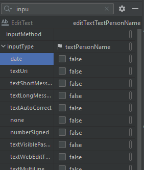
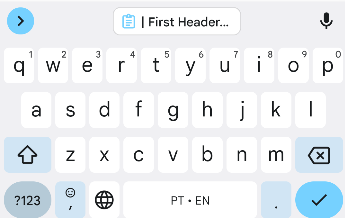
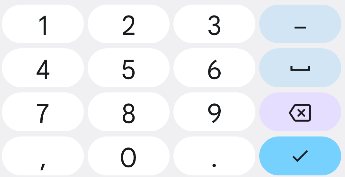
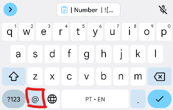
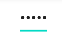
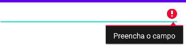

  

# Validação de formulários

  

  

Ao criar um formulário de preenchimento, usamos campos que podem permitir o usuário a digitar dedos ou selecionar uma opção entre diversas opções assim como nenhuma. Este formulário pode ter preenchimento obrigatório ou não, assim como os dados digitados ou inseridos pelo usuário pode conter regras que devem ser respeitadas. Segue algumas formas de validar, reduzir erros por meio do usuário e até facilitar a maneira como o usuário interagi com o seu app.

  

  

## InputType

  

  

Ao utilizar o componente `EditText`, uma das propriedades que podem ser ajustadas é o `InputType`, essa propriedade diz a respeito do tipo de dado que será preenchido pelo usuário em um campo de texto. Ao pesquisar pelo atributo `InputType` e expandir existe uma larga possibilidade de ajuste do teclado do usuário dependendo da opção selecionada. Para fazer a seleção basta selecionar o tipo até o campo ser exibido como *true*


.

  

  
Veja alguns exemplos de configuração de teclado de acordo com o `InputType` selecionado.

  
| **InputType** | Teclado | Descrição|
| ------------- | ------------- |-|
| **textPersonName** |  | Vem configurado como padrão, e faz o preenchimento com o primeiro caractere de cada palavra em maiúsculo.|
| **number** |  | Exibe apenas números no teclado.|
| **textEmailAddress** |  | Exibe os caracteres em minúsculos e adiciona o botão de arroba|
| **text** e **textPassword** |  | Ao marcar o **text** e **textPassword** o componente `EditText` substitui os caracteres por asteriscos|
  

## Exibindo feedback de erros

Ao validar o formulário caso tenha algum erro, pode ser então exibido um erro para o usuário, o código abaixo faz a validação se foi digitado algum texto em um componente `EditText`

  

```kotlin

lateinit var editText: EditText

...

// apos inicializacao do componente entao e feita a validacao

var textDigitado : String = editText.text.toString()


if(textoDigitado == "") {

editText.error = "Preencha o campo"

}


```



  

```kotlin
  
lateinit var editText: EditText

...


// após inicialização do componente então e feita a validação

// veja que foi adicionado o caractere de interrogação **?** esse caractere significa que a variável `textoDigitado` pode ser nula, e então a função `toIntOrNull()` tenta converter o texto para inteiro caso não consiga armazena nulo na variável `textoDigitado`.

var textoDigitado : Int? = editText.text.toString().toIntOrNull()


// caso a variável seja nula então a conversão para inteiro não deu certo, logo não foi digitado um numero e então e exibido um erro.

if(textoDigitado != null) {

editText.error = "Digite apenas numeros"

}
```
